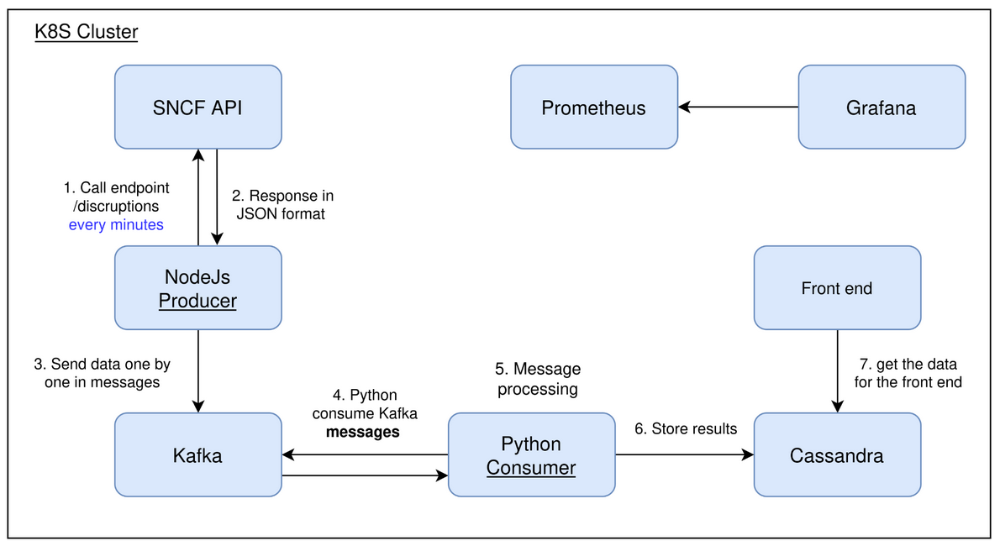

# SNCF Delay Analysis Project at ENSIMAG (2022-2023)

## Team

- **DevOps Engineer:** Valentin BAUD, Baptiste SEGEAT
- **Developer:** Lucas GEOFFROY, Guillaume PEYRACHON
- **Reliability Engineer:** Tanguy PAYMAL, Damien BERNO

## Technology Stack

This project leverages a robust technology stack to process and analyze train delay data.

### Node.js

- **Role:** Acts as the infrastructure's core producer.
- **Functionality:** Regularly calls the Navitia API to simulate a data stream, providing data for processing.

### Kafka

- **Role:** Real-time message broker for high-volume data management.
- **Rationale:** Chosen for its large developer community, facilitating easier learning and support.
- **Benefits:** Enables real-time streaming between producers (Node.js) and consumers (Python scripts).

### Python

- **Role:** Data processing and transformation engine. Acts as a consumer of data from Kafka.
- **Functionality:** Transforms and formats the data received from Kafka before storing it in Cassandra.
- **Choice over Spark:** Prioritized for its ease of understanding data transformations, especially beneficial with the team's existing Python expertise.

### Cassandra

- **Role:** Data storage for processed and transformed data.
- **Functionality:** Stores the final data used for generating reports and analyses.

### Kubernetes

- **Role:** Automated container orchestration platform.
- **Functionality:** Manages resource allocation and ensures the smooth operation of all containers within the cluster.

## Demonstration Application

The primary goal is to analyze train departure and arrival times to identify specific delay patterns. Possible statistical analyses include:

- National average delay (in minutes)
- Average delay per station
- Delay variance/standard deviation per department
- Comparison of statistical data across different stations

These analyses, performed with Python, provide a comprehensive overview of SNCF train delays.

## Automation Mechanisms

### Helm Chart

- **Role:** Facilitates application deployment in Kubernetes.
- **Functionality:** Streamlines the deployment and maintenance process for our applications within the Kubernetes cluster.

### Terraform & Ansible

- **Role:** Automate infrastructure provisioning.
- **Terraform:** Defines infrastructure as code, allowing for reproducible and consistent deployments.
- **Ansible:** Manages deployed machines and the Kubernetes cluster.

## Monitoring Mechanisms

To ensure system health and performance, we've implemented a comprehensive monitoring solution:

### Prometheus

- **Role:** Data collection and time-series database.
- **Functionality:** Collects metrics characterizing the data processing pipeline and stores them in a time-series database.
- **Rationale:** Open-source, mature, and widely adopted by enterprises.
- **Alternative options considered:** Telegraf & InfluxDB

### Grafana

- **Role:** Real-time dashboarding tool.
- **Functionality:** Creates intuitive dashboards using data from various sources (Prometheus). Offers extensive charting options and a user-friendly interface.

## Key Benefits of the Chosen Tools

This project's tech stack was chosen for its:

- **Scalability:** Kafka, Kubernetes, and Cassandra provide excellent scalability to handle large datasets and fluctuating workloads.
- **Maintainability:** Python, Terraform, Ansible, and Helm promote code reusability, automation, and easy maintenance.
- **Community Support:** The wide adoption of technologies like Kafka, Prometheus, and Grafana ensures readily available support and a vibrant community for problem-solving.
